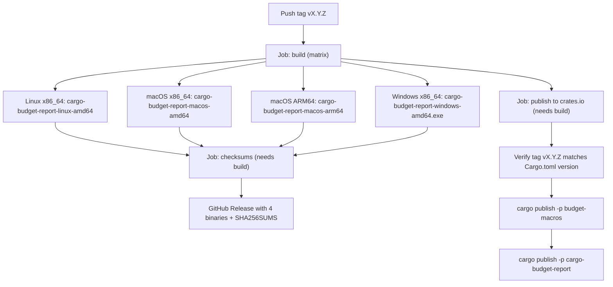

# Release Process

This document details the end-to-end release process for the `soroban-budget-assert` project, including pre-release preparation, version bumping mechanics, crate publish ordering, automated GitHub Actions CI workflows, verification, and failure recovery.

The canonical source of truth for the automated release pipeline is [`.github/workflows/release.yml`](https://github.com/Tollcraft/soroban-budget-assert/blob/main/.github/workflows/release.yml).

---

## 📦 Architecture & Packages

The repository is organized as a Cargo workspace publishing two crates to crates.io and cross-platform CLI binaries:

| Package | Crates.io Name | Role | Release Artifacts |
|---|---|---|---|
| `budget-macros` | `budget-macros` | Procedural macro crate (`#[budget_cpu_lt]`, `#[budget_mem_lt]`) | Published to crates.io |
| `cargo-budget-report` | `cargo-budget-report` | CLI tool and cargo subcommand for resource reporting | Published to crates.io + pre-compiled binaries on GitHub Releases |
| `budget-core` | `soroban-budget-assert-core` | Internal core library (not published to crates.io, `publish = false`) | Workspace dependency |
| `amm-pool-contract` | `amm-pool-contract` | Benchmark contract fixture (not published, `publish = false`) | Test fixture |

### Workspace Versioning

All member crates inherit their version from the workspace root manifest (`Cargo.toml`) via:

```toml
[package]
version.workspace = true
```

The single source of truth for the version is defined under `[workspace.package]` in the root [`Cargo.toml`](https://github.com/Tollcraft/soroban-budget-assert/blob/main/Cargo.toml):

```toml
[workspace.package]
version = "0.1.0"
```

When bumping versions, only `[workspace.package].version` in root `Cargo.toml` needs to be updated. All workspace crates advance in lockstep.

### Crate Publish Ordering

When publishing to crates.io, publishing order matters:

1. **`budget-macros`** is published **first**.
2. **`cargo-budget-report`** is published **second**.

**Why ordering matters:** `budget-macros` is an independent proc-macro crate with no workspace dependencies. Downstream crates or contracts that consume the macros or CLI depend on the macro crate being resolvable on crates.io. Publishing `budget-macros` first ensures that the macro definitions are available on the registry before the toolchain or downstream packages resolve against that version.

---

## ✅ Pre-Release Checklist

Before creating a release tag, complete the following steps on `main`:

1. **Working Tree Cleanliness:** Ensure all intended feature and bugfix PRs are merged into `main`.
2. **Update `CHANGELOG.md`:**
   - Move changes from the `## Unreleased` section into a new version header: `## [vX.Y.Z] - YYYY-MM-DD`.
   - Ensure all user-facing changes, bug fixes, and breaking changes are documented according to [Keep a Changelog](https://keepachangelog.com/).
3. **Bump Workspace Version:**
   - Update `version = "X.Y.Z"` under `[workspace.package]` in `Cargo.toml`.
   - Run `cargo check --workspace` to update `Cargo.lock` with the new version.
4. **Run Quality Gates Locally:**
   ```bash
   cargo fmt --all -- --check
   cargo clippy --workspace --all-targets -- -D warnings
   cargo test --workspace
   ```
5. **Verify PR Dry-Run CI:**
   - On every pull request targeting `main`, `.github/workflows/release.yml` automatically runs the `publish-dry-run` job:
     ```bash
     cargo publish -p budget-macros --dry-run
     cargo publish -p cargo-budget-report --dry-run
     ```
   - Ensure the dry-run check is green before merging the version bump PR to `main`.

---

## 🏷️ Cutting a Release

Once the version bump is merged into `main`:

1. **Create an Annotated Git Tag:**
   Tags must follow the `vX.Y.Z` naming convention (matching the version in `Cargo.toml` prefixed with `v`):
   ```bash
   git checkout main
   git pull origin main
   git tag -a v0.1.0 -m "Release v0.1.0"
   ```

2. **Push the Tag to GitHub:**
   ```bash
   git push origin v0.1.0
   ```

Pushing the `v*` tag triggers the automated release workflow in GitHub Actions.

---

## 🤖 What CI Does Automatically

When a tag matching `v*` is pushed, [`.github/workflows/release.yml`](https://github.com/Tollcraft/soroban-budget-assert/blob/main/.github/workflows/release.yml) executes three automated jobs in parallel/sequence:



### 1. `build` Job (Matrix across 4 targets)
Compiles `cargo-budget-report` in `--release` mode for four architectures:
- `x86_64-unknown-linux-gnu` (Ubuntu latest, installs `libdbus-1-dev`, `pkg-config`, `libudev-dev`) → `cargo-budget-report-linux-amd64`
- `x86_64-apple-darwin` (macOS latest Intel) → `cargo-budget-report-macos-amd64`
- `aarch64-apple-darwin` (macOS latest Apple Silicon) → `cargo-budget-report-macos-arm64`
- `x86_64-pc-windows-msvc` (Windows latest) → `cargo-budget-report-windows-amd64.exe`

Each binary is uploaded as a workflow artifact.

### 2. `checksums` Job (runs after `build`)
- Downloads all binary artifacts.
- Generates `SHA256SUMS` with `sha256sum cargo-budget-report-* > SHA256SUMS`.
- Creates or updates a GitHub Release for the tag using `softprops/action-gh-release@v3`, attaching all four binaries and the `SHA256SUMS` file.

### 3. `publish` Job (runs after `build`)
- Validates that the git tag version strictly matches the workspace version in `Cargo.toml`:
  ```bash
  TAG_VERSION="${GITHUB_REF_NAME#v}"
  WORKSPACE_VERSION=$(awk '/^\[workspace\.package\]/ {found=1} found && /^version = / {print; exit}' Cargo.toml | sed 's/.*= "\(.*\)"/\1/')
  if [ "$TAG_VERSION" != "$WORKSPACE_VERSION" ]; then
    echo "ERROR: Tag v$TAG_VERSION does not match workspace version $WORKSPACE_VERSION"
    exit 1
  fi
  ```
- Publishes `budget-macros` to crates.io using the secret `CARGO_REGISTRY_TOKEN`.
- Publishes `cargo-budget-report` to crates.io using the secret `CARGO_REGISTRY_TOKEN`.

---

## 🔍 Post-Release Verification

After the GitHub Actions workflow finishes:

1. **Verify GitHub Release:**
   - Navigate to the repository Releases page: `https://github.com/Tollcraft/soroban-budget-assert/releases/tag/vX.Y.Z`.
   - Confirm the release tag exists and contains the 4 pre-compiled binaries and `SHA256SUMS`.
   - Test downloading a binary and verifying checksum:
     ```bash
     sha256sum -c SHA256SUMS
     ```

2. **Verify Crates.io:**
   - Check `https://crates.io/crates/budget-macros` shows the new version.
   - Check `https://crates.io/crates/cargo-budget-report` shows the new version.

3. **Verify Installation:**
   - Install the new version from crates.io:
     ```bash
     cargo install cargo-budget-report --version X.Y.Z
     cargo budget-report --version
     ```

---

## 🛠️ Troubleshooting & Failure Recovery

A release failure can occur either before or after packages are published to crates.io. Because **crates.io is immutable** (published versions cannot be replaced, overwritten, or deleted), recovery depends on when the failure occurred.

### Scenario A: Failure *Before* crates.io Publish
*(e.g., Matrix build failure, system dependency issue, or tag mismatch)*

1. No crate was published to crates.io.
2. Delete the local and remote git tag:
   ```bash
   git tag -d vX.Y.Z
   git push origin :refs/tags/vX.Y.Z
   ```
3. Fix the underlying issue on a feature branch, merge to `main`, and re-tag `vX.Y.Z`.

### Scenario B: Failure *During or After* crates.io Publish
*(e.g., `budget-macros` published successfully, but `cargo-budget-report` failed, or a critical defect was discovered immediately post-release)*

1. **Do NOT delete the tag or attempt to re-publish the same version.** Crates.io will reject any attempt to re-upload the same version number.
2. **If a broken crate version was published:**
   Yank the affected release to prevent new projects from resolving it while preserving builds for existing lockfiles:
   ```bash
   cargo yank --version X.Y.Z budget-macros
   cargo yank --version X.Y.Z cargo-budget-report
   ```
3. **Cut a Patch Release:**
   - Bump `version = "X.Y.(Z+1)"` under `[workspace.package]` in `Cargo.toml`.
   - Document the fix in `CHANGELOG.md` under `## [vX.Y.(Z+1)]`.
   - Run quality checks and merge the fix to `main`.
   - Cut and push the new tag `vX.Y.(Z+1)`.

---

## 📋 Release Summary Table

| Step | Action | Responsibility |
|---|---|---|
| 1 | Update `CHANGELOG.md` & bump `[workspace.package].version` in `Cargo.toml` | Maintainer (PR to `main`) |
| 2 | Validate `cargo publish --dry-run` on both crates | CI (`publish-dry-run` job) |
| 3 | Create and push git tag `vX.Y.Z` | Maintainer |
| 4 | Build 4 platform binaries & generate `SHA256SUMS` | CI (`build` & `checksums` jobs) |
| 5 | Create GitHub Release with attached assets | CI (`checksums` job) |
| 6 | Publish `budget-macros` then `cargo-budget-report` to crates.io | CI (`publish` job) |
| 7 | Verify crates.io and GitHub Releases | Maintainer |
